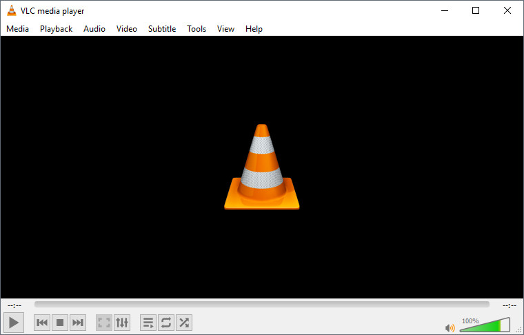
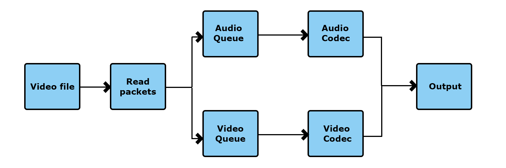
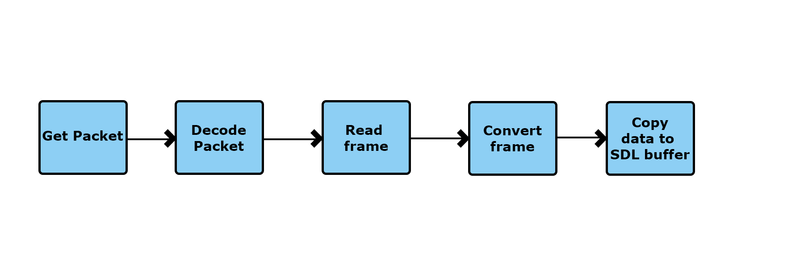
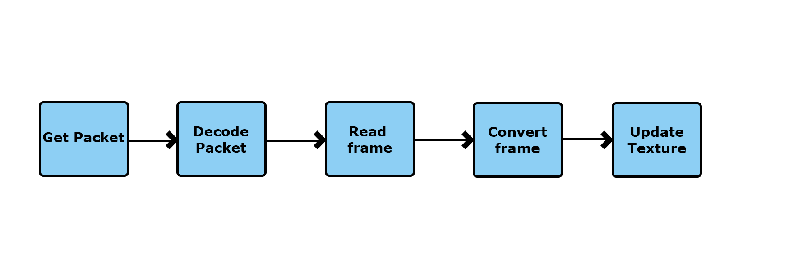
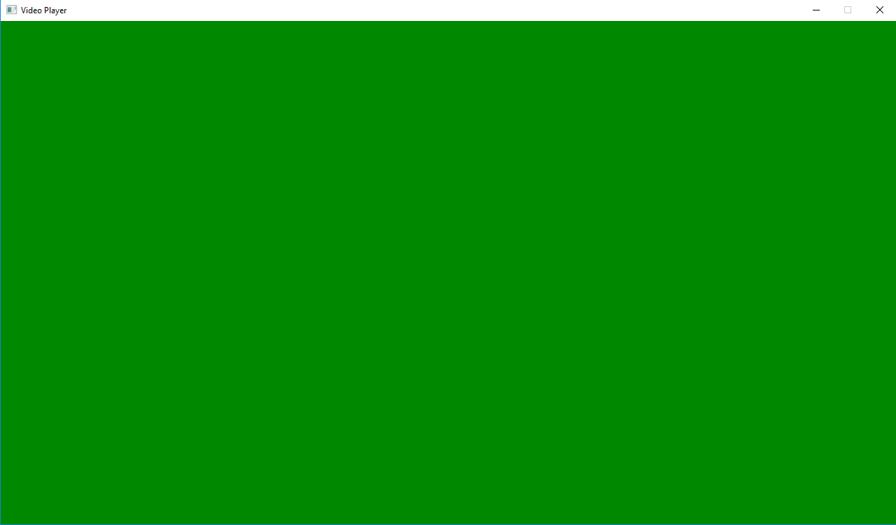
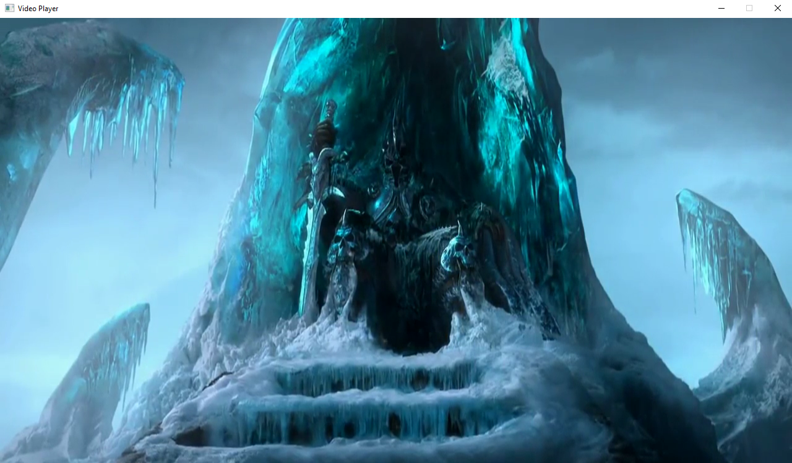

I am [Axel Alavedra](https://es.linkedin.com/in/axel-alavedra-cabello-113666121), student of the [Bachelor's Degree in Video Games by UPC at CITM](https://www.citm.upc.edu/ing/estudis/graus-videojocs/). This content is generated for the second year's subject Project 2, under supervision of lecturer [Ricard Pillosu](https://es.linkedin.com/in/ricardpillosu).

## Introduction
### What's a video player
A video player is basically a program that reads, processes, and outputs the content of a video file.
They have some basic functionalities like play, pause, stop, backforward and fastforward the video. Also, they implement some kind of progress bar which the user can click and skip the video to that position.



In video games, video players don't need as many functionalities, they usually only have play, pause(not all) and skip the video. It's similar to going to the cinema and watching a movie, with the ability to skip it if you don't like it.


### Why should I care?
Cinematics are always a cool way to introduce the player to your game, tell a story or show some breath-taking scenes. You could create a cinematic in your game processing it in real-time and never need a video player. But, sometimes the scene may be to complex to be processed in real time or you don't want your development team to spend time creating a cinematic. 
Then you need a pre-rendered cinematic, which can have this really complex scenes, high quality graphics that would take too much process time and you can even outsource your cinematic, making another company create it for you.
Now you need a video player to process that pre-rendered cinematic in your game.

Most engines on the market like Unity and Unreal Engine already have their own video player implemented, allowing it's user to play a different variety of video formats and on many different platforms.
If you are using your own engine, and you want to have a video player you have two options.
First option, outsource a video player like [Bink](http://www.radgametools.com/bnkmain.htm) from Rad game tools and implement it on your own engine.
The second option is to create your own video player for your engine, and this is what this research is about.
But before we start digging into the code, lets learn about some basics like what exactly is a video file.
## Video file
Mp4, avi, webm, ... We all heard about this file types right, they are video files. But do we really know what they are?
When I started this research I honestly had no idea what they were, all I knew is that every time I opened the file, a video magically would start playing on my selected video application.
A video file is just a container, like a box, where the audio, video and metadata is packed in a single file.


The metadata can be subtitles, author, title, synchronisation information, ...
Also, the container packs the video and audio in a way that allows streaming the content, so we can play it without having loaded the whole file.

As mentioned earlier, inside a container we have different kind of data, more precisely this data we call it a Stream. Each stream of data is encoded with a specific codec.
For example, audio codecs would be mp3, aac, ogg, wav, ... 
As for video codecs, we can find  H.264, H.265, Theora, VP8, VP9, ...


So this leads us to the conclusion that we have no idea what is actually inside a video file, as they can be in many different formats. 
Thankfully, some video files indicate what codecs it may contain, for example mp4 files usually have mp3 or aac audio codecs and H.264 or H.265 video codecs. There's other video files that are more generic like avi, which pretty much can contain any type of video and audio codecs.
Since codecs are such an important part of a video file, lets talk more in depth about them.
## Codecs
Have you ever tried to play a video on your computer and it just wouldn't work? Most likely codec problem and you had to look up on the internet to download and install it.
But what are codecs exactly?

The word codec comes from code and decode, and its basically a program (or piece of hardware) that packs data and compresses it (encode), also it takes that packed data and unpackages it (decode).  We need to do this because video and music files are really really big, which makes them hard to transfer and store.

There are so many different codecs in the world being used, and its because depending on what you are using the file for you may want a different codec, for example if you are streaming a video over the internet, you may want a codec that focuses on low latency, on the other hand if you have the file on your computer already, you may prefer to use a codec that has higher quality.

Now that we have an idea of what a codec is we can talk about license hell. Yes, each codec has its own license type, so developers need to pay special attention to what codec types they support, you don't want to end up with a furious lawyer trying to sue you because you played a 3 minute video in your game do you?
For example if you want to use the codec H.264, a high quality video codec used in mp4, you will need to pay licensing royalties.
There's some free codecs out there that a developer can use if they dont want to pay royalties, for example VP8 and VP9, both are video codecs owned by Google that are open and royalty-free and high quality.
## Reading a video file
Now that we have a basic understanding of video files and codecs, lets start working on creating our video player.
For this research i've decided to use ffmpeg libraries (libavcodec, libavutil, libavformat, libavfilter, libavdevice, libswscale and libswresample) because they work very well and allow you to play pretty much anything if you wanted to and they are used by YouTube and VLC media player. 
This means that some implementations may be specific for this type of libraries.
Also, we will use SDL to output the video and audio from the video file.

The basic idea of reading a video file is to open each stream that we want to receive data from (video, audio, subtitles, etc) and start receiving packets that we will put on a queue for each type of data.
While the packets are being received, we will start decoding and outputting the data depending on which type it is.



To be able to perform this process, we need two basic structures, StreamComponent and PacketQueue.

    struct StreamComponent
    {
    	AVStream* stream = nullptr;
    	AVCodecContext* context = nullptr;
    	AVFrame* frame = nullptr;
    	AVFrame* converted_frame = nullptr;
    	PacketQueue pktqueue;
    	double clock = 0.0;
    	int stream_index = 0;
    	bool finished = false;
    	void Clear();
    };

`StreamComponent` contains the information needed to be able to process all the data from a stream (video or audio).  We have the `stream` of data, the codec `context` (with information about the codec and the codec itself), the `packet queue` (which i'll explain next) and also two `frames`, one where we will output the decoded data from the packets and the other to output the data converted to a format that SDL can use.

    struct PacketQueue {
    	AVPacketList *first_pkt, *last_pkt;
    	int nb_packets;
    	int size;
    	SDL_mutex* mutex = nullptr;
    	SDL_cond* cond = nullptr;
    	bool paused = false;
    
    	void Init();
    	int PutPacket(AVPacket* pkt);
    	int GetPacket(AVPacket* pkt, bool block);
    	int Clear();
    };

This struct contains all the packets of a data type that we will be reading from the video file. `AVPacketList` contains a pointer to the `next` packet in the queue. 
### Reading packets
To read the packets all we need is a loop that reads the file, fills packets and puts each packet on its queue. Since we want to stream the video, we need to do this at the same time as we process the data, to be able to do this we will create a separate thread of execution. The thread will keep reading packets and placing them until it reaches the end of the file or we call it to stop because we want to skip the video.
Once we have our packets being put on a queue, we want to start decoding and outputting them.
### Decoding audio
To output the audio with SDL we need to open an audio device with a set of desired specs and also give it a function to callback.
On this callback function, we will receive a buffer of data that we will have to fill, so SDL can read it and reproduce it.
To fill the buffer first we will get a packet from the audio packet queue, decode it, put it into a frame, and convert the frame to a readable format for SDL.



Since we have to meet a length of buffer that SDL gives us on the callback, we need to store this decoded and converted data into our own audio buffer, this way if the frame we decoded is larger than what SDL is asking us, we can give it a chunk of it and save the rest for later.
### Decoding video
To output the video all we have to do is get a packet from the video packet queue, decode it, put it into a frame, and convert the frame to a readable format for SDL. Once we have the data converted, we put all this data into a SDL_Texture that will be rendered by the engine.



After we've done all of this, we should be ready to play our video right? We press the play button and everything is being outputted, all good, but then you notice how the video and the audio are not synchronised. Let's fix it.
### Synchronisation
There are three different approaches on synchronising a video output.
 - Sync video to audio 
 - Sync audio to video
 - Sync audio and video to internal clock

In this research i've decided to sync the video to the audio because it's a bit more simple and easy to understand than the other two.
The basic idea is that we calculate at which second the audio and the video are, calculate the delay between them and then call the texture update on that delay time.
So how do we do it?
Inside a decoded frame we can find what it's called a presentation time stamp (PTS). As the name indicates this is the time where the data of the frame should be outputted. 
But this value is only a time stamp so what we need to do is divide it by the time base of the stream (fps or frequency). We will call this value the clock, having a clock for each stream.
Now we can call the next video refresh on the delay between both clocks, successfully synchronising our video. That's it, video player done.
### Improvements
This video player is nowhere near done, it needs a lot of work, but for a basic start point it's going to work. Future improvements that should be done to this are:
 - Ability to read webm video files, with vp9 codec to make a royalty-free version. 
 - Make the video player skip frames when the video is too far behind.
 - Sync the video and the audio to internal clock, to avoid problems with different sound cards playing audio at different speed.
 - The way pts is used is pretty much worng, it works on the type of file being used, but should be changed to enable other video formats.
## Exercises
Documentation link: https://ffmpeg.org/doxygen/4.1/index.html
### TODO 1: Open the codec
 We need to find the decoder of the stream we are trying to open, after that we allocate our codec context and give it value with the parameters of the codec associated to the stream. After this we can open the codec.
 
 Result: Pressing F1 will show a green screen.
 
 
 
 Solution:
 ```
    codec = avcodec_find_decoder(format->streams[stream_index]->codecpar->codec_id);
	if (codec == NULL)
		LOG("Unsupported codec for stream index %i", stream_index);

	codec_context = avcodec_alloc_context3(codec);
	if (avcodec_parameters_to_context(codec_context, format->streams[stream_index]->codecpar) < 0) {
		LOG("Failed parameters to context for stream %i", stream_index);
	}

	if (avcodec_open2(codec_context, codec, NULL) < 0)
	{
		LOG("Error opening codec");
	}
```
### TODO 2: Get the packets
We need to read a frame from stream, putting it into a packet. After that we check the stream index of the packet and send it to the corresponding packet queue. Finish the loop unreferencing the packet.

Result: Same as before, we are only putting packets on a queue.

Solution: 
```
    ret = av_read_frame(player->format, &pkt);
    if (ret < 0)
    {
        if (ret == AVERROR_EOF) LOG("Finished reading packets");
        else LOG("Error reading packet");
        player->quit = true;
        break;
    }

    if (pkt.stream_index == player->video.stream_index) 
    {
        player->video.pktqueue.PutPacket(&pkt);
    }
    else if (pkt.stream_index == player->audio.stream_index)
    {
        player->audio.pktqueue.PutPacket(&pkt); /
    }
    av_packet_unref(&pkt);
```
### TODO 3: Decoding audio
We need to get a packet from the packet queue, send that packet to the decoder and then receive a decoded frame.
On the function to get a packet pass it the variable quit aswell.
Result: Audio plays for some seconds.

Solution:
```
if (audio.pktqueue.GetPacket(&pkt, quit) < 0)
{
	if (quit)
		audio.finished = true;
	return -1;
}

ret = avcodec_send_packet(audio.context, &pkt);
if (ret < 0)
{
	LOG("Error sending audio pkt to decode");
	return -1;
}

ret = avcodec_receive_frame(audio.context, audio.frame);
```
### TODO 4: Decoding video
Same as the last one but with the video queue and video component. There's a TODO 4.1 where you have to call SDL_StartTimer.

Result: Video plays but really fast and out of sync with the audio.



Solution: 
```
ret = avcodec_send_packet(video.context, &pkt);
if (ret < 0)
{
	LOG("Error sending video packet for decoding");
	return;
}

ret = avcodec_receive_frame(video.context, video.frame);
4.1
SDL_AddTimer(40, (SDL_TimerCallback)VideoCallback, this);
```
### TODO 5: Synchronisation
Get the pts from the actual frame, set it as video clock and calculate the delay between video clock and audio clock. Remember to multiplicate the pts with the time_base of the stream, so get the time in seconds. Now send that delay to the SDL_AddTimer converted to ms. Do the same pts calculation for the audio clock in TODO 5.1

Result: Video and audio are synchronised


Solution:
```
double pts = video.frame->pts;
if (pts == AV_NOPTS_VALUE)
{
	pts = video.clock +
		(1.f / av_q2d(video.stream->avg_frame_rate)) / av_q2d(video.stream->time_base);
}
video.clock = pts;

double delay = (video.clock*av_q2d(video.stream->time_base)) - (audio.clock*av_q2d(audio.stream->time_base));
if (delay < 0.01)
	delay = 0.01;
	
SDL_AddTimer((Uint32)(delay * 1000 + 0.5), (SDL_TimerCallback)VideoCallback, this);
```
## Useful links
https://www.xiph.org/

https://ffmpeg.org/

https://developer.android.com/guide/topics/media/media-formats.html#recommendations

https://www.get-metadata.com/file-info/sample-fmt

https://www.gamasutra.com/view/news/170671/Indepth_Playing_with_video.php

http://dranger.com/ffmpeg/tutorial01.html

https://ffmpeg.org/doxygen/4.1/index.html

https://www.cnblogs.com/welen/p/3666270.html

https://github.com/FFmpeg/FFmpeg/blob/master/fftools/ffplay.c

https://en.wikipedia.org/wiki/Video_file_format

https://video.online-convert.com/

The code in this research is based off [An ffmpeg and SDL Tutorial](http://dranger.com/ffmpeg/ffmpeg.html)  by dranger and [FFplay](https://github.com/FFmpeg/FFmpeg/blob/master/fftools/ffplay.c) by Fabrice Bellard.
